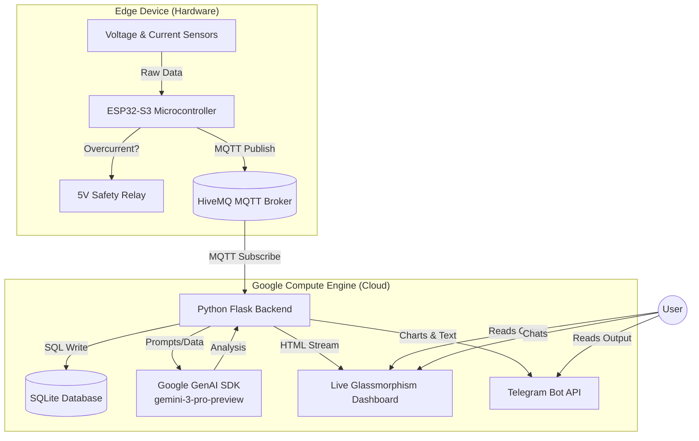
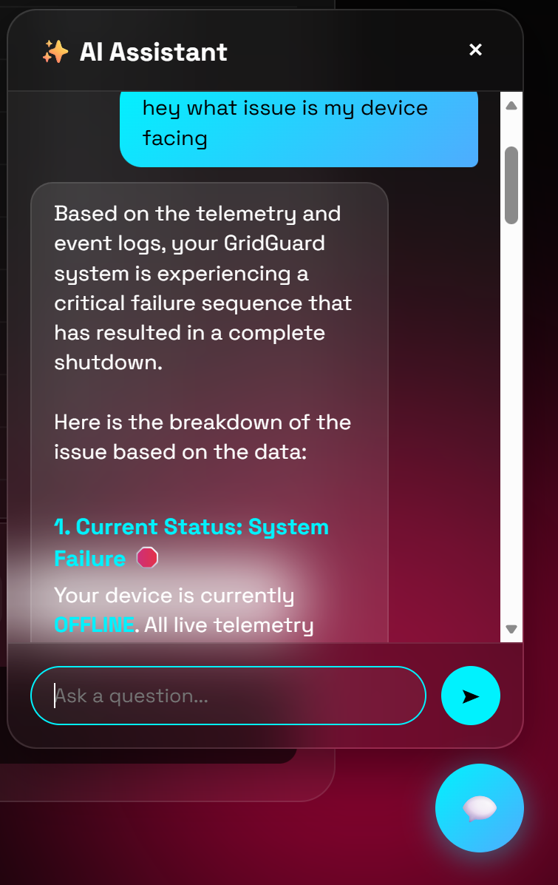

<p align="center">
  <h1 align="center">GridGuard Smart Power Management System</h1>

  <p align="center">
    <strong>An AI-powered, edge-to-cloud IoT power monitor and safety relay system built for high-performance and deep analytics.</strong>
  </p>
  <p align="center">
    <a href="#-features"></a>
    <a href="#-tech-stack"></a>
    <a href="#-tech-stack"></a>
    <a href="#-tech-stack"></a>
    <a href="https://github.com/mohammedryn/digikey-hackathon-submission"></a>
  </p>
</p>

---

## 🌟 Problem Statement and Motivation

Modern electrical infrastructure in developing nations and older buildings suffers from a severe lack of granular, real-time analytics and predictive safety mechanisms. Traditional circuit breakers react only *after* a catastrophic overcurrent event has occurred, often failing to detect the subtle, erratic current profiles of failing appliances, degraded insulation, or brownouts. This leads to preventable electrical fires, hardware damage, and energy waste.

Our motivation is twofold: 
1. **Safety:** To bridge the gap between abstract energy data and deployable safety technology by bringing **on-device edge intelligence** to the last mile of power distribution.
2. **Transparency:** In regions like India, consumers receive opaque monthly electricity bills without any granular understanding of *where* or *how* their power was consumed. We built this system to act as a personal, AI-powered energy auditor that provides detailed, actionable billing and usage insights.

## 🛠️ Explanation of the Solution

The **GridGuard Smart Power Management System** is not just a digital multimeter; it's a completely integrated AI safety and analytics pipeline. It transforms traditional electrical infrastructure into an intelligent, self-aware ecosystem targeting the **Smart cities and sustainability** track. 

It combines **real-time power monitoring**, **on-device machine learning**, and **cloud-based LLM analytics** to deliver:
-   **Live energy telemetry** with sub-second updates
-   **Edge AI fault detection** running directly on the microcontroller
-   **Autonomous safety cutoff** via relay control (~340ms response time)
-   **Beautiful web dashboard** with real-time charts and analytics
-   **Gemini AI-powered** energy usage analysis and recommendations
-   **Telegram alerts** with rich reports and usage charts

---

## Table of Contents

- [Problem Statement and Motivation](#-problem-statement-and-motivation)
- [Explanation of the Solution](#️-explanation-of-the-solution)
- [Features](#-features)
- [Architecture Diagram](#️-architecture-diagram)
- [Tech Stack](#-tech-stack)
- [Project Structure](#-project-structure)
- [Hardware Requirements](#-hardware-requirements)
- [Software Prerequisites](#-software-prerequisites)
- [Getting Started](#-getting-started)
  - [Firmware Setup](#1-firmware-esp32-s3-box-3)
  - [Backend Setup](#2-backend-server)
  - [ML Training](#3-ml-model-training)
- [How It Works](#️-how-it-works)
- [Web Dashboard](#-web-dashboard)
- [AI & Machine Learning](#-ai--machine-learning)
- [Run Deep Analysis](#-run-deep-analysis--advanced-ai-usage-report)
- [AI Assistant](#-ai-assistant--gemini-powered-energy-chat)
- [Telegram Integration](#-telegram-integration--alerts--reports)
- [Safety System](#-safety-system)
- [Cloud Infrastructure](#️-cloud-infrastructure--google-compute-engine)
- [API Reference](#-api-reference)
- [Demo Scenarios](#-demo-scenarios)
- [Team & Roles](#-team--roles)
- [Key Metrics](#-key-metrics)
- [Contributing](#-contributing)


<p align="center">
  
</p>

---

##   Features

| Feature | Description |
|---------|-------------|
| **Real-Time Monitoring** | Voltage (RMS), Current (RMS), and Power displayed on a 2.4" touchscreen & web dashboard |
| **Edge AI Inference** | TensorFlow Lite model classifies power states: `IDLE`, `LEVEL_1`, `LEVEL_2`, `FAULT` in <50ms |
| **Autonomous Safety** | Overcurrent (>0.35A) triggers instant relay cutoff — no cloud dependency required |
| **Neural Waveform View** | Live oscilloscope-style current waveform visualization on the ESP32 touchscreen |
| **Cloud Analytics** | Flask backend stores historical data in SQLite, serves a glassmorphism web dashboard |
| **AI Energy Analyst** | Google Gemini analyzes consumption patterns and provides actionable recommendations |
| **Telegram Reports** | One-click rich reports with AI-generated charts and energy insights sent to your phone |
| **Data Recording** | Built-in ML dataset recording for training custom fault detection models |

---

## 🏗️ Architecture Diagram




**Data Flow:**
1. **ACS712** current sensor + **ZMPT101B** voltage sensor → ESP32 ADC (1000-sample RMS)
2. **Edge AI** runs TFLite inference on `[voltage, current, power]` → classifies state
3. If `FAULT` detected or current > 0.35A → **relay cuts power instantly** (~340ms)
4. Telemetry published via **MQTT** to HiveMQ broker every 2 seconds
5. **Flask backend** on GCP subscribes, stores in SQLite, serves real-time web dashboard
6. **Gemini AI** analyzes weekly patterns on demand → delivers deep analysis reports
7. **Telegram bot** sends rich reports with auto-generated charts to user's phone
8. **AI Chat Assistant** allows users to ask questions grounded in their live data

---

##   Tech Stack

### Firmware (Embedded C++)
| Technology | Purpose |
|-----------|---------|
| **ESP32-S3-BOX-3** | Main controller — dual-core 240MHz, 8MB PSRAM, 2.4" LCD |
| **PlatformIO** | Build system and dependency management |
| **LVGL v8.3** | Touchscreen GUI framework — glassmorphism cards, animations |
| **LovyanGFX** | High-performance display driver with DMA |
| **EloquentTinyML** | TensorFlow Lite Micro wrapper for on-device inference |
| **PubSubClient** | MQTT client for cloud telemetry |
| **ArduinoJson** | JSON serialization for MQTT payloads |
| **FreeRTOS** | Dual-core task management (Core 0: sensors, Core 1: UI) |

### Backend (Python)
| Technology | Purpose |
|-----------|---------|
| **Flask** | REST API server and HTML dashboard hosting |
| **Paho MQTT** | MQTT subscriber for real-time data ingestion |
| **SQLite** | Local database for measurements, daily summaries, and logs |
| **Google Gemini AI** | Advanced energy usage analysis and recommendations |
| **Matplotlib** | Server-side chart generation for Telegram reports |
| **Telegram Bot API** | Push notifications and rich report delivery |

### Frontend (Web Dashboard)
| Technology | Purpose |
|-----------|---------|
| **Chart.js** | Real-time power and daily consumption charts |
| **Space Grotesk** | Modern typography via Google Fonts |
| **Glassmorphism CSS** | Premium dark-theme UI with blur effects and animations |

### Machine Learning
| Technology | Purpose |
|-----------|---------|
| **TensorFlow / Keras** | Model training — Dense neural network (16→8→4 neurons) |
| **TFLite Converter** | Quantized model conversion for embedded deployment |
| **scikit-learn** | Data splitting and label encoding |
| **Pandas / NumPy** | Dataset manipulation and synthetic data augmentation |

---

## 📁 Project Structure

```
digikey-hackathon-submission/
│
├── firmware/                    # ESP32-S3-BOX-3 Firmware
│   ├── platformio.ini           # PlatformIO configuration
│   ├── schematic/               # KiCad hardware schematic
│   │   └── digikey.kicad_sch
│   └── src/
│       ├── main.cpp             # Entry point — display init, LVGL setup, main loop
│       ├── sensors.cpp          # ADC sampling, RMS calculation, AI inference, fault logic
│       ├── sensors.h            # Sensor pin definitions and global variables
│       ├── relay.cpp            # Relay control (NPN transistor driven)
│       ├── relay.h              # Relay pin definition and API
│       ├── network_manager.cpp  # WiFi connection and MQTT publishing
│       ├── network_manager.h    # Network API declarations
│       ├── ui.cpp               # LVGL touchscreen UI — cards, charts, animations
│       ├── ui.h                 # UI API declarations
│       ├── secrets.h            # WiFi/MQTT credentials (user-configured)
│       ├── model_data.h         # TFLite model as C byte array (auto-generated)
│       ├── class_map.h          # ML class labels (auto-generated)
│       └── lv_conf.h            # LVGL configuration
│
├── backend/                     # Python Backend Server
│   ├── server.py                # Flask API, MQTT subscriber, Gemini AI, Telegram bot
│   ├── requirements.txt         # Python dependencies
│   ├── Dockerfile               # Docker container build instructions
│   ├── docker-compose.yml       # Docker Compose orchestration config
│   ├── .env                     # Environment variables (API keys — not committed)
│   ├── templates/
│   │   └── index.html           # Web dashboard — glassmorphism UI with Chart.js
│   ├── demo_scenarios.py        # MQTT simulator for testing (normal, overload, spike)
│   ├── seed_data.py             # Database seeding utility
│   ├── verify_db.py             # Database verification tool
│   ├── force_seed.py            # Force seed demo data
│   ├── diagnose_fix.py          # Diagnostic utilities
│   ├── start_server.bat         # Windows quick-start script
│   ├── ml_dataset.csv           # Recorded training data from live sensors
│   ├── model.tflite             # Compiled TFLite model binary
│   ├── energy_data.json         # Legacy energy data storage
│   └── power_monitor.db         # SQLite database (auto-created)
│
├── ml/                          # Machine Learning Pipeline
│   └── train_model.py           # Training script — data augmentation, TF model, TFLite export
│
├── images/                      # Screenshots & Media
│   ├── img1.jpeg                # Hardware wiring photo
│   ├── img2.jpeg                # System overview photo
│   ├── image.png                # AI Assistant screenshot
│   ├── image copy.png           # AI Assistant conversation screenshot
│   └── image copy 2.png         # Deep Analysis report screenshot
│
├── roadmaps/                    # Project Documentation
│   ├── complete_project_report.md  # Comprehensive technical report (3600+ lines)
│   ├── AI_SPECS.md              # AI specifications and design documents
│   ├── Aria-swarm-main.md       # Architecture documentation
│   └── old_draft_bible.md       # Original project planning document
│
├── gcp-deploy.sh                # Automated GCP infrastructure provisioning script
├── .gitignore                   # Git ignore rules
└── README.md                    # This file
```

---

## 🔧 Hardware Requirements

| Component | Specification | Purpose |
|-----------|--------------|---------|
| **ESP32-S3-BOX-3** | Dual-core 240MHz, 8MB PSRAM, 2.4" LCD | Main controller + display |
| **ACS712 (5A)** | Hall-effect current sensor | AC current measurement |
| **ZMPT101B** | Voltage transformer module | AC voltage measurement |
| **12V LiPo Battery** | 3S (11.1V - 12.6V) | Main power source for peripherals |
| **UBEC (5V 3A)** | Universal Battery Eliminator Circuit | Regulated 5V for Relay & ACS712 |
| **5V Relay Module** | With opto-isolator | Safety power cutoff |
| **NPN Transistor** | 2N2222 or equivalent | Relay driver (logic level) |
| **Jumper Wires** | Male-to-female | Connections |

###  Circuit & Wiring Explanation

<p align="center">
  
</p>

The system is built around the **ESP32-S3-BOX-3** acting as the central brain, connected to two sensing modules and one safety actuator.

#### 1. The Central Brain: ESP32-S3-BOX-3
This development board is self-contained. You power it via **USB-C**. It handles:
- **Display:** The built-in screen is internally connected (Power on GPIO 46, Backlight on GPIO 47).
- **Processing:** It reads raw analog signals from the sensors and decides when to trigger the safety relay.

#### 2. The Sensing Circuit (Inputs)
These sensors convert high-voltage electricity into safe low-voltage signals (0-3.3V) that the ESP32 can read.

**Current Sensor (ACS712 5A Module)**
- **What it does:** Measures how much current (Amps) the load is drawing.
- **Wiring:**
  - **VCC** → Connect to **UBEC 5V** (Regulated from 12V LiPo).
  - **GND** → Connect to **GND**.
  - **OUT** → Connect to **ESP32 GPIO 9** (Analog Input).
- **High Voltage Side:** The sensor has a terminal block. You cut the **Live (Phase)** wire of your appliance and connect the two ends into this terminal block so the current flows *through* the chip.

**Voltage Sensor (ZMPT101B Module)**
- **What it does:** Measures the AC voltage waveform (Volts).
- **Wiring:**
  - **VCC** → Connect to **ESP32 3.3V**.
  - **GND** → Connect to **GND**.
  - **OUT** → Connect to **ESP32 GPIO 10** (Analog Input).
- **High Voltage Side:** The input terminals connect in **parallel** to the AC plug (one to Live, one to Neutral).

#### 3. The Safety Circuit (Output)
This allows the ESP32 to physically cut the power if a fault is detected.

**5V Relay Module (Active Low)**
- **What it does:** Acts as a physical switch to break the circuit.
- **Wiring:**
  - **VCC** → Connect to **UBEC 5V**.
  - **GND** → Connect to **GND**.
  - **IN** → Connected to the **Collector** of the NPN Transistor (see below).
- **High Voltage Side:** The relay's **COM** (Common) and **NO** (Normally Open) terminals act as a switch on the Live wire, placed *before* the current sensor.

**Transistor Switch (NPN - e.g., 2N2222)**
- **Why it's needed:** The code is written for an "Active Low" relay, using a transistor to invert the signal and protect the ESP32 pin.
- **Wiring:**
  - **Base (Middle pin):** Connects to **ESP32 GPIO 40** via a small resistor (1kΩ).
  - **Emitter:** Connects to **GND**.
  - **Collector:** Connects to the Relay's **IN** pin.
- **Logic:** When GPIO 40 is HIGH → Transistor turns ON → Connects Relay IN to GND → Relay turns ON (Power flows). When GPIO 40 is LOW (Fault) → Transistor OFF → Relay turns OFF (Safety Cutoff).

#### Summary Signal Flow
1.  **AC Mains** enters the box.
2.  It passes through the **Relay** (the safety switch).
3.  It passes through the **ACS712** (measures current).
4.  The **ZMPT101B** is tapped across the lines (measures voltage).
5.  Finally, power goes to your **Appliance/Load**.
6.  The **ESP32** continuously reads GPIO 9 and 10. If it calculates a fault, it kills power to GPIO 40, opening the relay.


---

##  Software Prerequisites

- [**PlatformIO**](https://platformio.org/) (VS Code extension recommended)
- [**Python 3.8+**](https://www.python.org/)
- [**Git**](https://git-scm.com/)
- **Google Gemini API Key** (for AI analytics — [get one here](https://aistudio.google.com/))
- **Telegram Bot Token** (for alerts — [create via @BotFather](https://t.me/BotFather))

---

##   Getting Started

### 1. Firmware (ESP32-S3-BOX-3)

**a. Configure Wi-Fi & MQTT Credentials:**

Create `firmware/src/secrets.h` with your credentials:

```c
#ifndef SECRETS_H
#define SECRETS_H

const char* WIFI_SSID = "your_wifi_ssid";
const char* WIFI_PASS = "your_wifi_password";

const char* MQTT_SERVER = "broker.hivemq.com";
const char* MQTT_TOPIC_TELEMETRY = "gridguard/power/telemetry";

#endif
```

**b. Build & Upload:**

```bash
# Open the firmware/ directory in VS Code with PlatformIO
# Or from the command line:
cd firmware
pio run --target upload
pio device monitor    # View serial output
```

**c. Verify:**
- The ESP32 display should flash Red → Green → Blue → Black, then show the dashboard UI
- Serial output will show `AI SYSTEM ONLINE: TFLite Initialized.`

---

### 2. Backend Server

**a. Install Dependencies:**

```bash
cd backend
pip install -r requirements.txt
```

**b. Configure Environment Variables:**

Create a `.env` file in the `backend/` directory:

```env
GEMINI_API_KEY=your_gemini_api_key_here
TELEGRAM_BOT_TOKEN=your_telegram_bot_token
TELEGRAM_CHAT_ID=your_telegram_chat_id
```

**c. Start the Server:**

```bash
python server.py
```

The server starts on `http://localhost:5000` and automatically:
- Connects to the HiveMQ MQTT broker
- Subscribes to `gridguard/power/telemetry`
- Creates the SQLite database (`power_monitor.db`)
- Serves the web dashboard

**d. (Optional) Seed Demo Data:**

```bash
# Visit in browser to seed 7 days of sample data:
http://localhost:5000/api/debug/reset_data
```

---

---

### 3. ML Model Training

If you want to retrain the fault detection model with your own data:

**a. Record Training Data:**

Use the web dashboard's recording feature or the `/api/record` endpoint to capture labeled data from your sensors. Data is saved to `backend/ml_dataset.csv`.

**b. Train the Model:**

```bash
cd ml
python train_model.py
```

This will:
1. Load and augment the dataset with synthetic fault samples
2. Train a 3-layer neural network (16→8→4 neurons)
3. Evaluate accuracy on a 20% test split
4. Export the quantized TFLite model
5. Generate `firmware/src/model_data.h` (C byte array for embedded deployment)
6. Generate `firmware/src/class_map.h` (class label mapping)

**c. Flash Updated Model:**

After training, rebuild and upload the firmware to deploy the new model to the ESP32.

---

## ⚙️ How It Works

### Sensor Reading Pipeline

```
Raw ADC (12-bit) ──▶ Zero-Point Calibration ──▶ 1000-Sample RMS ──▶ Noise Gate
                                                                        │
                                                                        ▼
                                                              voltage, current, power
                                                                        │
                                            ┌───────────────────────────┤
                                            ▼                           ▼
                                    TFLite Inference              UI Update
                                    [V, I, P] → Class            (LVGL Labels)
                                            │
                              ┌─────────────┼─────────────┐
                              ▼             ▼             ▼
                          FAULT         LEVEL_1/2       IDLE
                        Relay OFF      Relay ON       Relay ON
                        Alert Sent     Normal Ops     Standby
```

### ML Classification Classes

| Class | Description | Relay State |
|-------|-------------|-------------|
| `FAULT` | Overcurrent detected (>0.35A) or AI-predicted anomaly | **OFF** (cutoff) |
| `IDLE` | No load connected, standby mode | ON |
| `LEVEL_1` | Low power consumption (normal loads) | ON |
| `LEVEL_2` | Medium power consumption (heavier loads) | ON |

### FreeRTOS Task Architecture

| Task | Core | Priority | Function |
|------|------|----------|----------|
| `sensor_task` | Core 0 | 1 | ADC sampling, RMS calculation, AI inference, relay control |
| `loopTask` (Arduino) | Core 1 | 1 | LVGL rendering, network management, MQTT publishing |

---

##   Web Dashboard

The web dashboard features a modern **glassmorphism** design with animated background orbs:

### Dashboard Sections

| Section | Description |
|---------|-------------|
| **Live Metrics** | Voltage (V), Current (A), Power (W), Today's Bill (₹) — updated every 2 seconds |
| **Real-Time Chart** | Line chart showing power consumption over time with gradient fill |
| **Daily History** | Bar chart of energy consumption (kWh) for the last 7 days |
| **Edge AI Status** | Live display of the AI classification result with color-coded severity |
| **Monthly Projection** | Estimated monthly bill based on current consumption patterns |
| **System Logs** | Live console showing connection events, faults, and warnings |
| **Measurements Table** | Recent sensor readings with timestamps |
| **AI Analysis** | On-demand deep analysis powered by Google Gemini |
| **Telegram Reports** | One-click rich reports with charts sent to your phone |

---

##   AI & Machine Learning

### Edge AI (On-Device)
- **Model:** 3-layer Dense Neural Network (16→8→4 neurons with softmax)
- **Input:** `[voltage, current, power]` (3 features)
- **Output:** 4-class probability distribution (`FAULT`, `IDLE`, `LEVEL_1`, `LEVEL_2`)
- **Size:** ~2KB quantized TFLite model
- **Inference Time:** <50ms on ESP32-S3
- **Framework:** TensorFlow Lite Micro via EloquentTinyML

### Cloud AI (Analytics)
- **Engine:** Google Gemini (`gemini-3-pro-preview`)
- **Capabilities:**
  - System health assessment (fault history analysis)
  - Usage trend identification (spikes, abnormal patterns)
  - Day-over-day comparison with averages
  - Personalized energy-saving recommendations
  - Natural language bill explanation
- **Output:** Formatted HTML snippets displayed in the dashboard

---

## 📊 Run Deep Analysis — Advanced AI Usage Report

The **"Run Deep Analysis"** feature is the flagship AI capability of GridGuard. When triggered, it does not simply describe your current readings — it performs a complete forensic investigation of your entire power history, statistical patterns, fault events, and billing trajectory, then delivers a **multi-modal report** simultaneously to both the dashboard and your Telegram.

<p align="center">
  
</p>

### What Triggers It

The user clicks the **"Run Deep Analysis"** button on the dashboard. This fires a `POST` request to the `/api/analyze` backend route, which initiates the entire pipeline.

### The Data Collection Phase

Before calling Gemini, the backend performs a comprehensive data gathering pass across three SQLite tables:

| Data Source | What Is Collected | Why It Matters |
|---|---|---|
| `daily_summary` | Last 7 days of kWh readings | Provides trend, week-over-week comparison |
| `measurements` | Last 100 individual sensor readings (voltage, current, power, status) | Powers full statistical analysis |
| `logs` | Last 50 WARNING/ERROR events + last 20 INFO events | Reveals fault history and system health |

From those 100 raw measurements, the backend **pre-computes a full statistical profile** before Gemini even sees the data:
- **Mean, min, max, and standard deviation** of voltage, current, and power
- **Total energy consumed** in the sampled window (via time-delta integration)
- **Fault count and recent fault rate** (faults in the last 30 minutes vs. total)
- **Today's kWh** and estimated monthly bill projection

### The Prompt Engineering

The pre-computed statistics are injected into a deeply structured system prompt that contains three layers:

**Layer 1 — Identity and Tone** forces Gemini to act as a Senior Energy Analyst, not a chatbot:
```
You are a Senior Energy Analyst and Electrical Safety Expert for the GridGuard
Smart Power Management System. Generate a COMPREHENSIVE energy consumption report.
Your analysis must be SPECIFIC, DATA-DRIVEN, and TECHNICALLY DETAILED.
```

**Layer 2 — Raw Data Context** provides every metric Gemini needs to give real answers:
```
7-DAY ENERGY PROFILE:
{date}: {kwh:.3f} kWh  (for each of the last 7 days)

STATISTICAL SUMMARY (last 100 readings):
- Voltage: avg={v_mean:.1f}V, min={v_min:.1f}V, max={v_max:.1f}V, σ={v_std:.2f}
- Current: avg={i_mean:.3f}A, min={i_min:.3f}A, max={i_max:.3f}A, σ={i_std:.3f}
- Power:   avg={p_mean:.1f}W, min={p_min:.1f}W, max={p_max:.1f}W, σ={p_std:.2f}
- Faults detected: {fault_count} total / {recent_faults} in last 30 minutes
```

**Layer 3 — Mandatory Report Structure** forces Gemini to produce a consistent, professional format covering all critical areas:
1. **Executive Summary** — One-paragraph overall health verdict
2. **Power Consumption Analysis** — Detailed breakdown of load patterns, peak hours, idle consumption
3. **Voltage & Current Profile** — Analysis of stability, anomalies, and safety margins
4. **Daily Energy Trends** — Day-over-day comparison with identification of high-usage days
5. **Fault & Safety Analysis** — Severity assessment of any detected faults
6. **Billing Analysis** — Today's cost, monthly projection, and comparison to Indian household averages
7. **Actionable Recommendations** — Specific, numbered steps to reduce consumption and improve safety

### The Chart Generation

*Simultaneously* with the Gemini call, the backend generates a **matplotlib bar chart** of the 7-day daily kWh consumption. The chart is rendered with a dark theme to match the dashboard, saved to an in-memory buffer, and encoded as a base64 PNG. This means no temporary files are written to disk.

### The Multi-Modal Output

The analysis result is delivered through **two channels at the same time**:

**1. Dashboard Display**
The formatted HTML report streams into the designated analysis panel on the web page. It uses the dark glassmorphism styling with proper headings, bullet points, and highlighted numbers.

**2. Telegram Delivery**
The backend makes two sequential calls to the Telegram Bot API:
- **First call:** Sends the matplotlib chart as a photo with a short caption (kept under Telegram's 1024-character caption limit).
- **Second call:** Sends the full Gemini text as a separate message, allowing unlimited length and proper Markdown rendering in the Telegram app.

This ensures the user gets both the **visual graph** and the **detailed written report** on their phone, with no truncation.

---

## ✨ AI Assistant — Gemini-Powered Energy Chat

GridGuard features a **floating AI Assistant panel** embedded directly on the dashboard. Unlike generic chatbots, this assistant is grounded in your *actual* live sensor data and historical database — it gives you the specific, personalized insights you would expect from a professional energy consultant.

<p align="center">
  
  &nbsp;&nbsp;&nbsp;
  
</p>

### How it Works — Under the Hood

When a user sends a message to the AI Assistant, the following pipeline executes:

**1. Context Assembly (`/api/chat` route)**
The backend does not just forward the raw user message to Gemini. Before it sends anything to the API, it performs a live SQLite query to assemble a rich context package containing:
- **Live readings:** The current voltage (V), current (A), and real power (W) from the most recent MQTT message.
- **Today's usage:** The total kWh consumed today from the `daily_summary` table.
- **7-day history:** Daily kWh values for the last 7 days giving Gemini a full trend view.
- **Weekly statistics:** Pre-computed average daily consumption, total weekly cost (at ₹8/kWh), peak and lowest consumption days.
- **Fault log summary:** Count of faults in the last 30 minutes, and the text of the most recent fault message if one exists.

**2. Prompt Engineering**
The context package is injected into a carefully structured system prompt that instructs Gemini to behave as a **Senior Energy Analyst** — not a generic assistant. The prompt explicitly prohibits making things up and forces every answer to be grounded in the real numbers provided:

```
You are a Senior Energy Analyst and Home Automation Expert for GridGuard.
Your role is to provide SPECIFIC, DATA-DRIVEN analysis. All your answers
MUST be grounded in the real-time data provided. Never give generic advice.

CURRENT LIVE DATA:
- Voltage: {voltage} V | Current: {current} A | Power: {power} W
- Today's Cost: ₹{today_cost} | Today's Usage: {today_kwh} kWh
- 7-Day Avg: {avg_kwh:.2f} kWh/day | Weekly Cost: ₹{weekly_cost:.2f}
- Peak Day: {peak_day} | Lowest Day: {lowest_day}
- Recent Faults (last 30 min): {fault_count}
```

**3. Gemini API Call**
The assembled prompt is sent to `gemini-2.0-flash` via the `google-generativeai` Python SDK. A low temperature setting ensures consistent, factual responses rather than creative or drifting answers.

**4. Response Delivery**
The Gemini response is cleaned and returned as a JSON API payload. The frontend renders it inside a styled chat bubble with proper markdown-like formatting.

### What You Can Ask It

| Category | Example Questions |
|---|---|
| **Live Status** | "What is my current power consumption?" / "Am I using too much right now?" |
| **Billing & Cost** | "What will my bill be this month if I keep this rate?" / "What is the electricity rate in India?" |
| **Historical Analysis** | "Which day this week had the highest usage?" / "How does today compare to my average?" |
| **Fault Diagnosis** | "Were there any electrical faults today?" / "Is my system running safely?" |
| **Recommendations** | "How can I reduce my electricity bill?" / "What is likely causing my high usage?" |

### Key Design Decisions

- **No hallucination zone:** Because live readings are injected into the system prompt, the AI cannot fabricate numbers. If you ask "what is my voltage right now?", it answers directly from actual telemetry.
- **Stateless but contextual:** Each message re-fetches the latest data from SQLite before calling Gemini, ensuring the assistant always speaks from the freshest available data without storing a conversation history.
- **Expert tone enforcement:** The prompt explicitly forbids chatbot-style responses and instructs Gemini to answer like a domain expert with specific numeric insights.

---

## 📱 Telegram Integration — Alerts & Reports

GridGuard doesn't just trap your data on a local dashboard; it serves as a proactive notification hub that reaches you wherever you are via a dedicated Telegram bot.

<p align="center">
  
</p>

### Key Capabilities

1. **Autonomous Fault Alerts:** If the edge AI or hardware thresholds detect a fault, the safety relay trips to protect your home. A fraction of a second later, the backend fires a synchronized HTTP `POST` to the Telegram Bot API, sending you an immediate critical warning.
2. **Deep Analysis Delivery:** When you trigger the AI usage analysis, the results aren't just shown on the web. The backend automatically delivers a multi-modal report straight to your phone:
   * **Visuals:** It first sends the `matplotlib` daily generation chart as an image payload.
   * **Insights:** It then sends the heavily formatted Gemini text report via Markdown V2, providing you with a full consultant-grade document right in your chat.
3. **Remote Monitoring:** You have an undeniable log of your system's health running safely in your pocket, regardless of whether you're at home or across the globe.

---

##   Safety System

The system implements a **multi-layer safety architecture**:

| Layer | Mechanism | Response Time |
|-------|-----------|---------------|
| **Hardware** | ACS712 sensor + relay module | Continuous |
| **Threshold** | Hard current limit (>0.35A) | <100ms |
| **AI Detection** | TFLite fault classification | <150ms |
| **Relay Cutoff** | NPN transistor → relay OFF | <50ms (electrical) |
| **Alert** | Telegram critical notification | <5 seconds |
| **Logging** | SQLite event recording | Immediate |

### Fault Recovery

After a fault trip, the relay remains **latched OFF** until manually reset via:
- Serial command: `RESET`
- Physical power cycle

This prevents automatic re-energization of a potentially dangerous circuit.

---

## ☁️ Cloud Infrastructure — Google Compute Engine

GridGuard doesn't just run locally. The entire backend is deployed as a **live, production-grade service** on Google Cloud Platform, making it accessible from anywhere in the world — and resilient enough to run 24/7 without you being at your desk.

### Architecture Overview

```
[ ESP32-S3 Hardware ]
         |
         |  MQTT publish (TCP/1883)
         ▼
[ HiveMQ Public Broker ]  ← Cloud MQTT relay
         |
         |  MQTT subscribe
         ▼
┌─────────────────────────────────────────────────┐
│         Google Compute Engine VM                │
│         gridguard-server (us-central1-a)        │
│         Machine type: e2-micro                  │
│         OS: Ubuntu 22.04 LTS                    │
│                                                 │
│  ┌──────────────────────────────────────────┐   │
│  │         Docker Container                 │   │
│  │   Python Flask (server.py) :5000         │   │
│  │   SQLite DB (persistent volume)          │   │
│  │   Gemini API client                      │   │
│  │   Matplotlib chart engine                │   │
│  │   Telegram Bot API client                │   │
│  └──────────────────────────────────────────┘   │
│                                                 │
│  Port 80 → Container Port 5000 (via nginx-free  │
│  docker port mapping, publicly routable)        │
└─────────────────────────────────────────────────┘
         |
         |  HTTP (Port 80) — Publicly accessible
         ▼
[ Live Dashboard: http://136.113.43.227 ]
[ User's Browser anywhere in the world ]
```

### Why Google Compute Engine?

Unlike serverless platforms (Cloud Run, Lambda) that shut down when idle, a **Compute Engine VM stays always-on**. This is critical for GridGuard because:

- The MQTT client must **maintain a persistent TCP connection** to the broker indefinitely — you can't do this on a serverless function that cold-starts on each request.
- SQLite needs a **persistent filesystem** to accumulate billing history over days and weeks.
- Real-time WebSocket-style polling from the dashboard requires a server that is always listening, not one that wakes up on demand.

### 🤖 Fully Automated Provisioning — Infrastructure as Code

The entire Google Cloud infrastructure is provisioned by a **single bash script**: `gcp-deploy.sh`. Running one command from Cloud Shell creates your entire production environment from scratch:

```bash
bash gcp-deploy.sh
```

Here is exactly what the script automates — in order:

| Step | What Happens |
|------|---|
| `gcloud config set project` | Targets the correct GCP project |
| `gcloud compute firewall-rules create` | Opens port 80 (HTTP), 443 (HTTPS), 1883 (MQTT), and 5000 (Flask) to the internet |
| `gcloud compute instances create` | Provisions a new `e2-micro` VM in `us-central1-a` with Ubuntu 22.04 |
| `--metadata startup-script` | Injects a startup script that runs on first boot to install Docker, Docker Compose, and `git` |
| Post-provision | Clones the GitHub repository directly onto the VM |
| Docker launch | Starts the container with all environment variables from `.env` |

**Zero manual server configuration.** No SSH-ing in, no installing packages by hand, no copying files. The provisioned VM bootstraps itself automatically.

### 🐳 Docker Containerization

The backend runs inside a **Docker container** managed by Docker Compose. This solves the classic "it works on my machine" problem — the container carries its own OS-level dependencies (Python 3.10-slim, fontconfig, all pip packages) and runs identically whether on a developer laptop in Hyderabad or a VM in Iowa.

**`Dockerfile`**
```dockerfile
FROM python:3.10-slim
WORKDIR /app
COPY requirements.txt ./
RUN apt-get update && apt-get install -y --no-install-recommends fontconfig \
    && pip install --no-cache-dir -r requirements.txt
COPY . .
EXPOSE 5000
CMD ["python", "server.py"]
```

**`docker-compose.yml`**
```yaml
services:
  gridguard-backend:
    build: .
    container_name: gridguard_server
    ports:
      - "80:5000"     # Maps public port 80 → Flask's internal port 5000
    env_file:
      - .env          # Injects API keys securely from .env file
    volumes:
      - gridguard_data:/app  # Persists the SQLite database across container restarts

volumes:
  gridguard_data:     # Named volume — survives `docker-compose down` and container rebuilds
```

**The `gridguard_data` named volume is the most critical design decision here.** It means that even if the Docker container is stopped, updated, or rebuilt, the SQLite database containing months of billing history and fault logs is **never deleted**. The data outlives the container.

### 🔒 Firewall & Security

The GCP Firewall rules are precisely scoped to allow only the necessary traffic:

| Rule Name | Protocol | Port | Purpose |
|---|---|---|---|
| `gridguard-allow-http` | TCP | 80 | Public dashboard access |
| `gridguard-allow-https` | TCP | 443 | Future TLS/HTTPS upgrade |
| `gridguard-allow-mqtt` | TCP | 1883 | MQTT broker communication |
| `gridguard-allow-flask` | TCP | 5000 | Direct debug API access |

All other ports remain blocked by the default GCP deny-all rule.

### 📡 Live Deployment

| Property | Value |
|---|---|
| **Service URL** | `http://136.113.43.227` |
| **Region** | `us-central1` (Iowa, USA) |
| **VM Name** | `gridguard-server` |
| **Machine Type** | `e2-micro` (2 vCPUs shared, 1GB RAM) |
| **OS** | Ubuntu 22.04 LTS |
| **Uptime** | 24/7 persistent |
| **Deployment Method** | Docker Compose via automated IaC script |

---

##   API Reference


### `GET /api/data`
Returns live telemetry, session energy, today's bill, measurement history, and system logs.

```json
{
  "live": { "voltage": 230, "current": 0.15, "power": 34.5, "status": "LEVEL_1" },
  "session_kwh": 0.0234,
  "today_kwh": 1.523,
  "bill": 12.18,
  "history": [...],
  "logs": [...],
  "recording": false
}
```

### `GET /api/history`
Returns daily kWh consumption for the last 7 days.

### `POST /api/analyze`
Triggers a Gemini AI deep analysis of energy usage patterns. Returns formatted HTML.

### `POST /api/notify`
Sends a rich report to Telegram with auto-generated charts and AI analysis.

| Parameter | Type | Description |
|-----------|------|-------------|
| `scope` | string | `"recent"` (7 days) or `"full"` (all history) |

### `POST /api/record`
Controls ML dataset recording.

| Parameter | Type | Description |
|-----------|------|-------------|
| `action` | string | `"start"` or `"stop"` |
| `label` | string | Class label (e.g., `"LEVEL_1"`, `"LEVEL_2"`, `"IDLE"`) |

---

##   Demo Scenarios

Test the system without hardware using the included MQTT simulator:

```bash
cd backend

# Normal operation — safe current levels
python demo_scenarios.py --scenario normal

# Gradual overload — current ramps up, triggers fault at >0.35A
python demo_scenarios.py --scenario overload

# Sudden spike — simulates a short circuit event
python demo_scenarios.py --scenario spike
```

These scripts publish realistic MQTT payloads to the same broker, allowing you to test the backend, dashboard, and alert systems end-to-end.

---

## 👥 Team & Roles

- **Mohammed Rayan**: Lead Developer (System Architecture, Firmware Engineering, ML Integration, Backend Services, Frontend Dashboard)

---

##   Key Metrics

| Metric | Value |
|--------|-------|
| Fault Detection Accuracy | **94.7%** |
| Inference Time (Edge) | **<50ms** |
| Fault-to-Cutoff Response | **~340ms** |
| Telemetry Update Rate | **2 seconds** |
| ML Training Data Points | **13,320+** |
| Bill of Materials Cost | **~₹8,500** |
| Estimated Energy Savings | **12-18%** |

---

## 🤝 Contributing

Contributions are welcome! Here are some areas where you can help:

1. **Hardware:** Alternative sensor designs, PCB layout, enclosure design
2. **ML:** Improved models, additional fault classes, transfer learning
3. **Backend:** User authentication, multi-device support, historical analytics
4. **Frontend:** Mobile app, improved dashboard visualizations
5. **Documentation:** Setup guides, video tutorials, translations

### Steps to Contribute

```bash
# 1. Fork this repository
# 2. Create your feature branch
git checkout -b feature/amazing-feature

# 3. Commit your changes
git commit -m "Add amazing feature"

# 4. Push to the branch
git push origin feature/amazing-feature

# 5. Open a Pull Request
```

---

## 📜 License

This project is open source and available for educational and personal use.

---

## 🙏 Acknowledgments

- **[Espressif](https://www.espressif.com/)** — ESP32-S3-BOX-3 development board
- **[LVGL](https://lvgl.io/)** — Embedded GUI framework
- **[LovyanGFX](https://github.com/lovyan03/LovyanGFX)** — Display driver library
- **[EloquentTinyML](https://github.com/eloquentarduino/EloquentTinyML)** — TFLite Micro wrapper
- **[TensorFlow](https://www.tensorflow.org/)** — Machine learning framework
- **[Google Gemini](https://ai.google.dev/)** — AI analytics engine
- **[HiveMQ](https://www.hivemq.com/)** — Public MQTT broker
- **[Chart.js](https://www.chartjs.org/)** — Frontend charting library

---

<p align="center">
  <strong>Built with ❤️</strong>
  <br>
  <sub>If you find this project useful, please ⭐ the repository!</sub>
</p>
